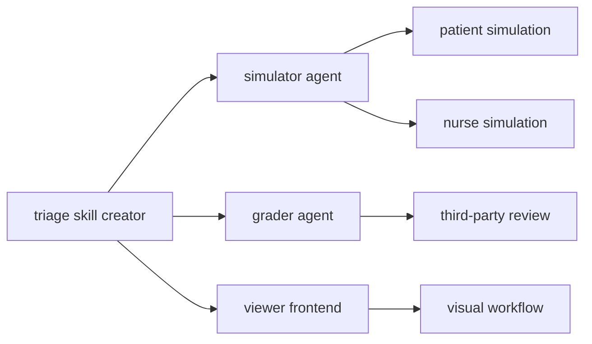
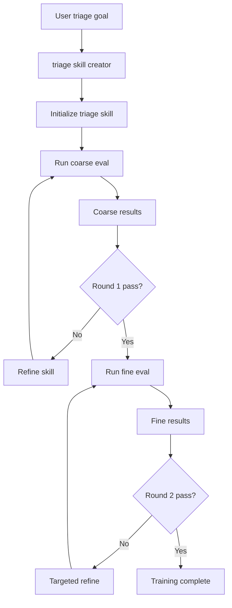

<h1 align="center">Triage Skill Creator</h1>

<p align="center">
  <strong>Build triage capabilities for your personal assistant from zero to production-ready</strong>
</p>

<p align="center">
  <a href="./README.md">简体中文</a> · English
</p>

- 🤔 Not sure which department to visit? You need your assistant to triage like a front desk.
- 🧩 Downloaded skills feel brittle? Your agent may not follow someone else’s static prompt pack.
- 📝 Staring at dense SKILL text with no idea what to change?

**Triage Skill Creator** helps your personal assistant gain **serious outpatient triage behavior**.
- 🧠 **Model-aware skill generation** — tailors prompts to different models so triage stays stable and reliable.
- 🔍 **Multi-grain evaluation and iteration** — coarse + fine-grained checks plus your feedback to improve over rounds.
- 🏥 **Open patient pool** — rich simulated cases; departments and scenarios are configurable.
- 🛠 **Readable, editable structure** — no “black box” prompts; you can understand and adjust what runs.

---

## 1. Getting started

### 1.1 Prerequisites
- Python installed and available on your PATH (project tooling can set up a venv later).
- A configured personal assistant runtime, e.g. [OpenClaw](https://github.com/openclaw/openclaw), [MedBot](https://github.com/SirryChen/medbot), [Cursor](https://cursor.com/), or another agent host.

### 1.2 Get this skill into a **chosen folder**

- **Clone the repo (recommended)**

```bash
git clone https://github.com/SirryChen/triage-skill-creator.git
```

- **Or download a ZIP**  
  Open the repo in the browser → **Code** → **Download ZIP**, unzip, and move the `triage-skill-creator` folder where you want it.

### 1.3 Where to put it

Usually under your agent project’s skills directory, for example:
- With **OpenClaw**, a common path is **`~/.openclaw/workspace/skills/triage-skill-creator`**
- With **Cursor**, often **`~/.cursor/skills/triage-skill-creator`** (or under a project you use with Cursor)

### 1.4 Download the patient pool

Data is hosted [on Hugging Face](https://huggingface.co/datasets/Sirrrrrrrrrry/patient-pool-TSC). Use the Hugging Face CLI to pull it:

```bash
brew install hf
export HF_ENDPOINT=https://hf-mirror.com
hf download Sirrrrrrrrrry/patient-pool-TSC --repo-type dataset --local-dir <project path>/triage-skill-creator/data/
```

### 1.5 Start the interactive triage-skill build

In chat with your agent, use prompts like these (natural language is fine; the skill workflow will drive the rest):

```
1. Help me build a skill for outpatient triage.
2. Start the first evaluation round.
3. Improve the skill from the eval results and run the first round again.
4. Start the second evaluation round.
5. Improve the skill from the eval results and run the second round again.
```

<table>
  <tr>
    <td align="center">
      <br>
      <sub>(a) Cursor interaction demo</sub>
    </td>
    <td align="center">
      <br>
      <sub>(b) OpenClaw interaction demo</sub>
    </td>
    <td align="center">
      <br>
      <sub>(c) Stage 1 coarse-grained evaluation</sub>
    </td>
  </tr>

  <tr>
    <td align="center">
      <br>
      <sub>(d) Stage 1 after one optimization iteration</sub>
    </td>
    <td align="center">
      <br>
      <sub>(e) Stage 2 fine-grained evaluation</sub>
    </td>
    <td align="center">
      <br>
      <sub>(f) Final triage skill</sub>
    </td>
  </tr>
</table>

---

## 2. Repository layout

```
<triage-skill-creator>/
├── SKILL.md                    # Agent runbook (paths, Steps 1–6, artifact formats)
├── requirements.txt            # serve.py, sample_emr, etc.
├── references/                 # triage_guide, prompts, standard_departments, workflow_workspace, grading_rubric…
├── agents/                     # grader / simulator / patient / supervisor notes
├── scripts/                    # sample_emr, prepare_phase2, aggregate_triage
├── data/triage_unified.json    # Sampling source (large; streamed reads)
└── viewer/                     # Workflow UI (see SKILL.md)
```

---

## 3. Architecture and flow

### 3.1 Components



### 3.2 Generation pipeline



### 3.3 UI and OpenClaw

When the host is detected as OpenClaw (path or env markers), the workflow UI uses a three-column layout and adds an **OpenClaw Chat** rail so you can drive the agent from the same window during eval steps.

---

## References

1. https://claude.com/plugins/skill-creator  
2. https://github.com/anord-wang/Chinese-Medical-Dialogue-System  

