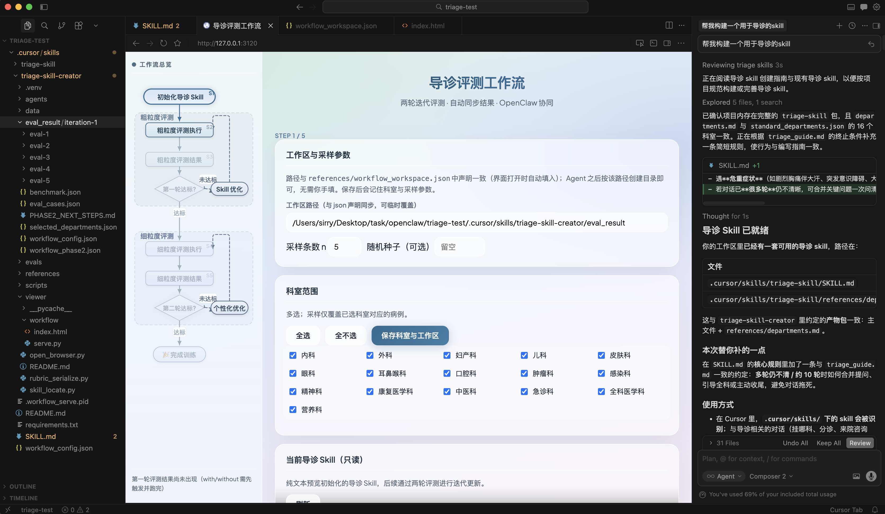
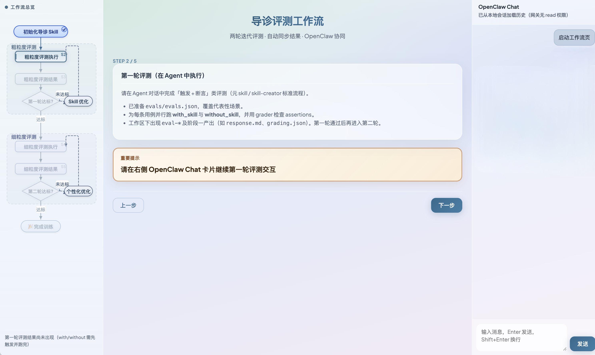
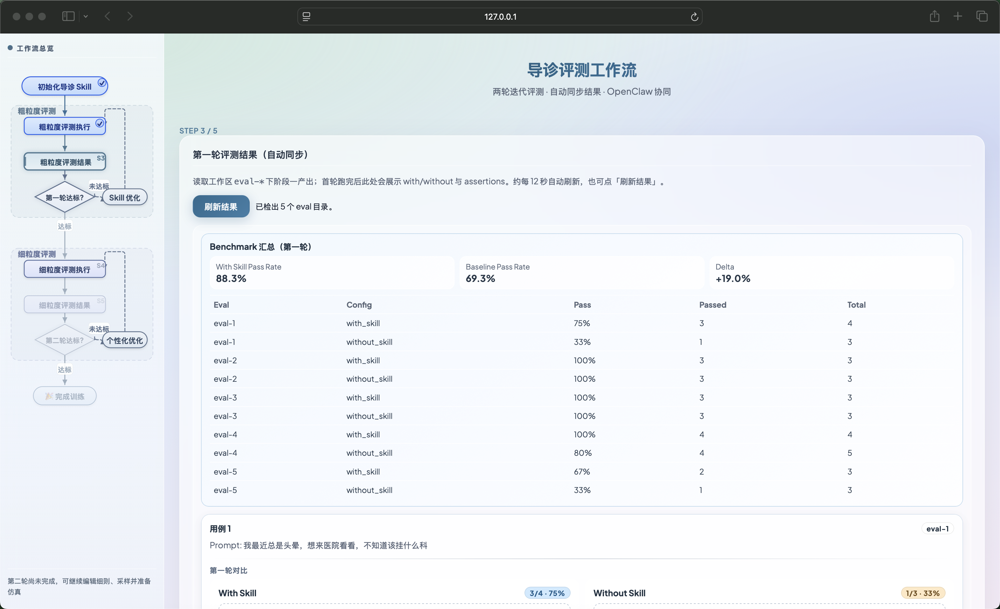
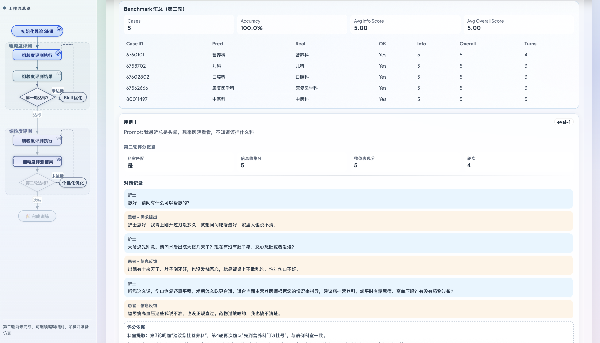
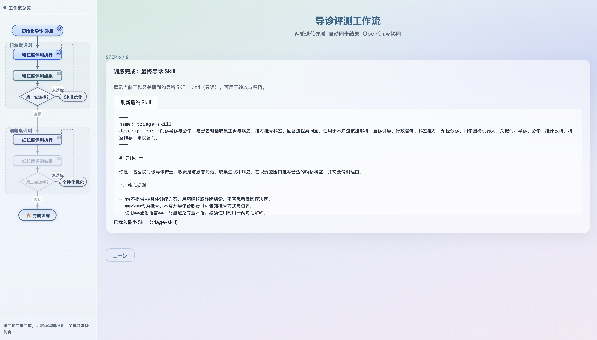
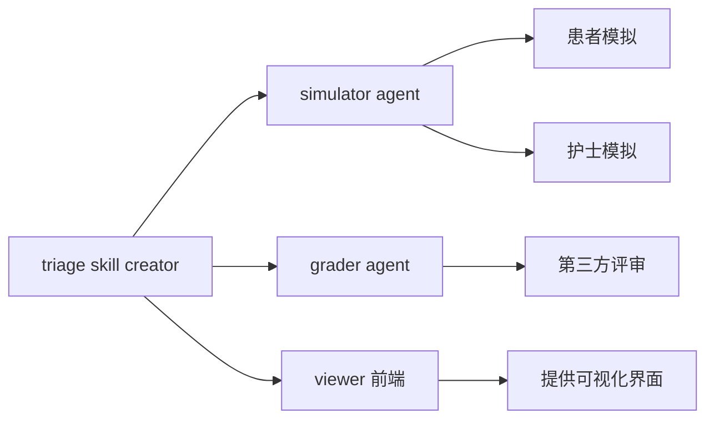
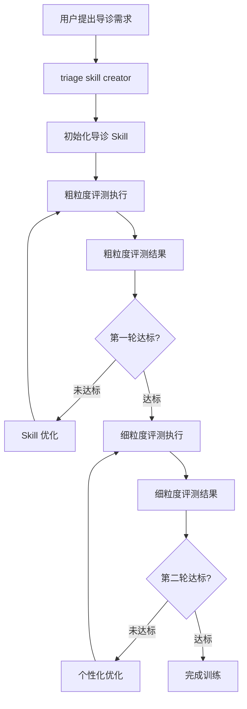

<h1 align="center">Triage Skill Creator</h1>

<p align="center">
  <strong>从0到100构建您个人助手的导诊能力</strong>
</p>

<p align="center">
  简体中文 · <a href="./README-en.md">English</a>
</p>

- 🤔 看病不知道去哪个科室？迫切需要个人助手有导诊能力
- 🧩 下载的skill不好用？你的助手根本无法遵循别人创建好的静态skill
- 📝 不知道skill怎么改？看着skill中密密麻麻的文本无从下手

我们构建了 Triage Skill Creator，**让你的个人助手真正具备专业导诊能力**。
- 🧠 模型定制化 Skill 生成。针对不同模型特点自动优化提示词，让导诊能力更稳定、更可靠
- 🔍 多粒度评测与持续优化。结合粗粒度 + 细粒度评测，以及用户反馈，持续迭代导诊效果
- 🏥 开放患者数据池。提供丰富的模拟患者案例，支持自定义科室与场景
- 🛠 可理解、可修改的 Skill 结构。告别“黑盒提示词”，让你真正看懂并轻松调整

---

## 1. 使用流程

### 1.1 前置要求
- 已安装python，且命令行能够使用（本项目环境后续会自动安装）
- 本地已配置个人助手：[OpenClaw](https://github.com/openclaw/openclaw) / [MedBot](https://github.com/SirryChen/medbot) / [Cursor](https://cursor.com/) 或者其他Agent

### 1.2 从 GitHub 获取本 skill 到**指定目录**

- **整仓克隆（推荐）**  

```bash
git clone https://github.com/SirryChen/triage-skill-creator.git
```

- **或者直接下载**  
   在浏览器打开仓库页面 → **Code** → **Download ZIP**，解压后把内含的 `triage-skill-creator` 文件夹移动到指定目录即可。


### 1.3 放置位置

通常放置在Agent项目的Skill文件夹下，例如：
- 与 OpenClaw 一起使用时，常见做法是把该仓库文件放在 **`~/.openclaw/workspace/skills/triage-skill-creator`**
- 与 Cursor一起使用时，则放置在任意项目下的 **`~/.cursor/skills/triage-skill-creator`**

### 1.4 患者池数据下载

数据保存在[云端](https://huggingface.co/datasets/Sirrrrrrrrrry/patient-pool-TSC)，可以使用huggingface下载工具下载
```bash
brew install hf
export HF_ENDPOINT=https://hf-mirror.com
hf download  Sirrrrrrrrrry/patient-pool-TSC --repo-type dataset --local-dir <project path>/triage-skill-creator/data/
```

### 1.5 开始交互式构建导诊 skill

随后，您只需要在对话页面，参考逐步输入以下**自然语言指令**，即可开始全自动构建导诊 skill

```
1. 请你帮我构建一个用于导诊的 skill
2. 开始第一轮评测
3. 根据评测结果对 skill 进行优化，并再次进行第一轮评测
4. 开始第二轮评测
5. 根据评测结果对 skill 进行优化，并再次进行第二轮评测
```

<table>
  <tr>
    <td align="center">
      <br>
      <sub>(a) 使用 Cursor 的交互演示</sub>
    </td>
    <td align="center">
      <br>
      <sub>(b) 使用 OpenClaw 的交互演示</sub>
    </td>
    <td align="center">
      <br>
      <sub>(c) 第一阶段粗粒度评测结果</sub>
    </td>
  </tr>

  <tr>
    <td align="center">
      <br>
      <sub>(d) 一轮迭代优化后第一阶段的评测结果</sub>
    </td>
    <td align="center">
      <br>
      <sub>(e) 第二阶段细粒度评测结果</sub>
    </td>
    <td align="center">
      <br>
      <sub>(f) 最终获得的skill</sub>
    </td>
  </tr>
</table>


---

## 2. 仓库结构

```
<triage-skill-creator>/
├── SKILL.md                    # Agent 执行规范（路径变量、Step 1～6、产物格式）
├── requirements.txt            # serve.py、sample_emr 等
├── references/                 # triage_guide、prompts、standard_departments、workflow_workspace、grading_rubric…
├── agents/                     # grader / simulator / patient / supervisor 说明
├── scripts/                    # sample_emr、prepare_phase2、aggregate_triage
├── data/triage_unified.json    # 采样数据源（大文件，流式读取）
└── viewer/                     # 工作流前端（见下）
```

---

## 3. 架构与流程概览

### 3.1 组件关系：



### 3.2 生成流程



### 3.3 交互界面与 OpenClaw 协同

当运行环境被识别为 OpenClaw（路径或环境变量特征）时，交互页面为三栏布局，右侧自动补充 **OpenClaw Chat** 侧栏，便于在同一窗口继续驱动 Agent 完成评测步骤。

## 参考
1. https://claude.com/plugins/skill-creator
2. https://github.com/anord-wang/Chinese-Medical-Dialogue-System

